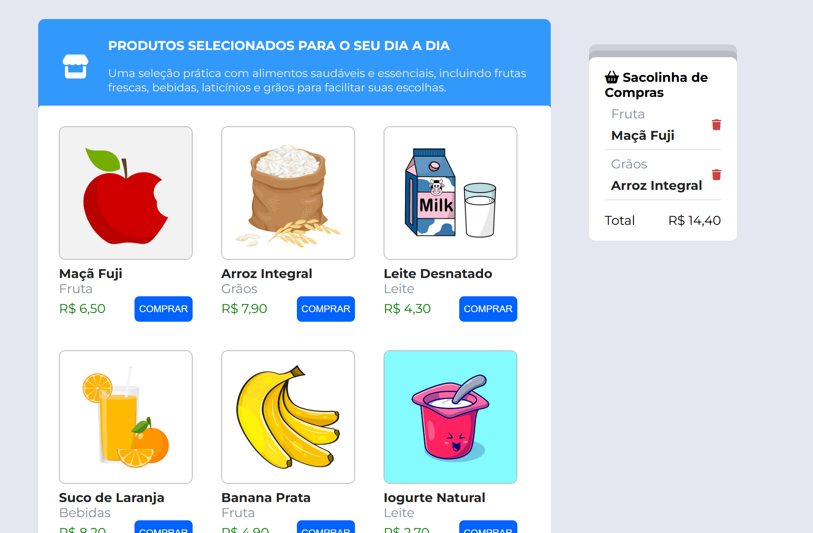

# Loja Web

Uma aplicação web de loja fictícia onde o usuário pode visualizar produtos, adicionar itens à sacola e calcular o total da compra.

# Preview



## Funcionalidades

- Visualização de uma vitrine com produtos selecionados.
- Adição de produtos à sacola de compras.
- Cálculo automático do valor total.
- Remoção de itens da sacola.
- Layout responsivo e moderno com design simples e funcional.

---

## Tecnologias Utilizadas

- **HTML5** - Estrutura semântica da aplicação.
- **CSS3** - Estilização visual com uso de Flexbox e Grid.
- **JavaScript (Vanilla)** - Manipulação de DOM, lógica de compra, e controle de estado.
- **Font Awesome** - Ícones para elementos visuais.
- **Google Fonts (Montserrat, Roboto)** - Tipografia moderna e legível.
- **JSON** - Simulação de base de dados com produtos (`dataBase.json`).

---

## Princípios e Boas Práticas Adotadas

| Princípio                     | Aplicação                                                                 |
|------------------------------|---------------------------------------------------------------------------|
| **Separação de responsabilidades** | HTML (estrutura), CSS (estilo), JS (lógica) estão organizados em arquivos distintos. |
| **Componentização de funções JS** | Criação de funções reutilizáveis como `createItem`, `renderCardList`, `addItem`, etc. |
| **Boas práticas de acessibilidade** | Uso de elementos semânticos e ícones com propósito visual.                        |
| **Design Responsivo e Flexível**   | Uso de `flexbox`, `gap`, e colunas (`col-*`) para adaptação a vários tamanhos.     |
| **State Management Simples**       | Controle do estado de itens da sacola com o objeto `states`.                      |
| **Internacionalização**           | Uso de `Intl.NumberFormat` para formatação de preços no padrão brasileiro (BRL).   |

---

## 📦 Como Executar

1. Clone o repositório:
   ```bash
   git clone https://github.com/xXanDEVx/Store.git   
